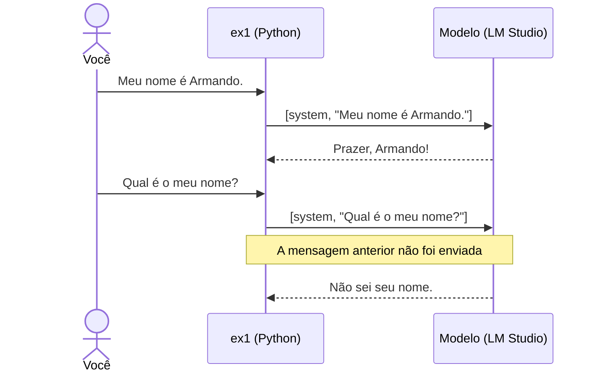
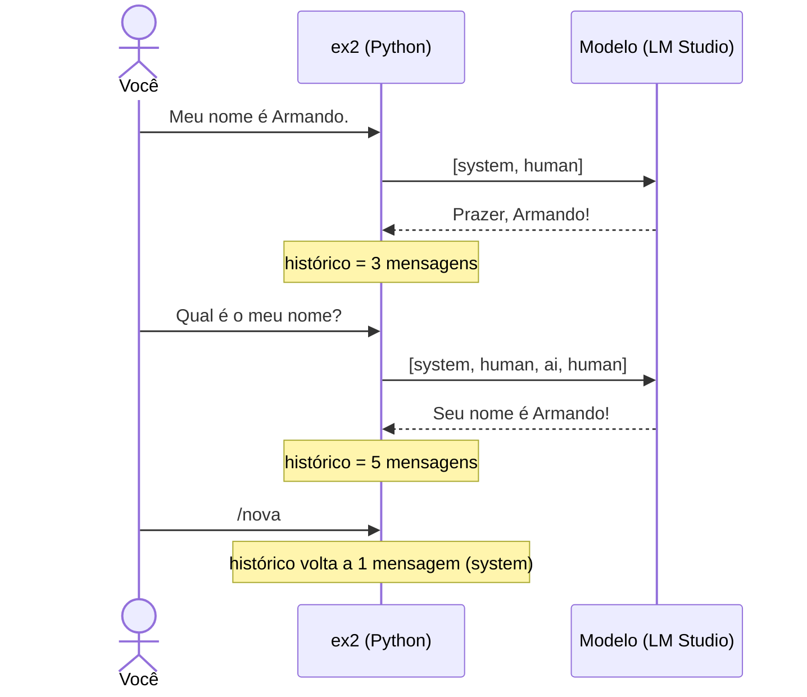
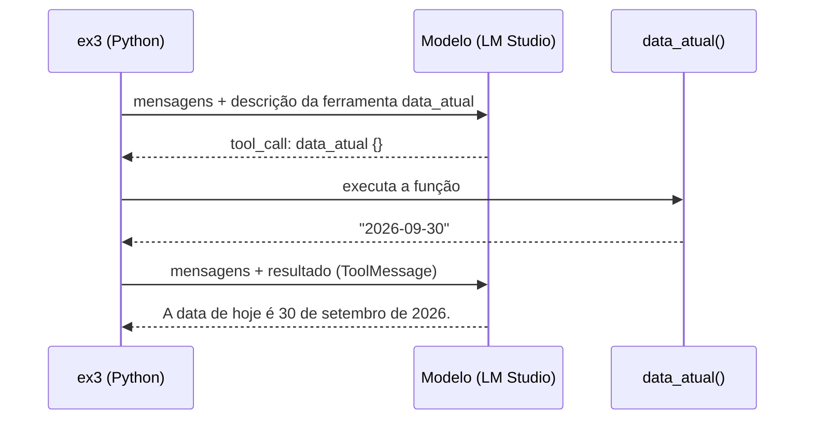
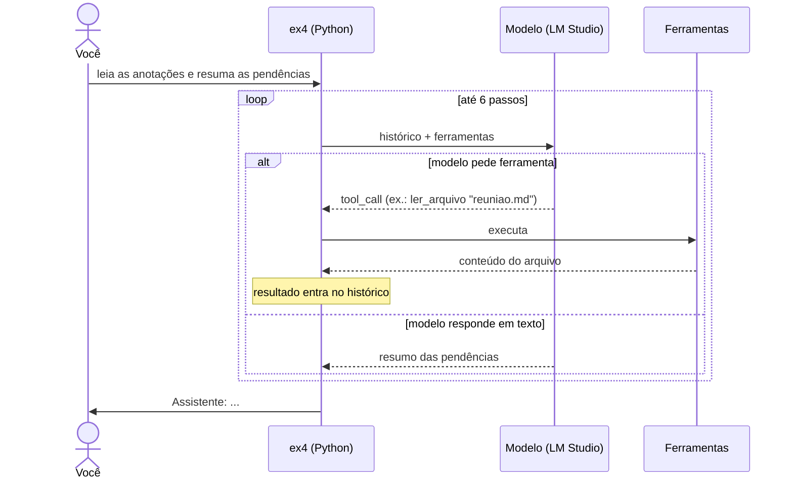
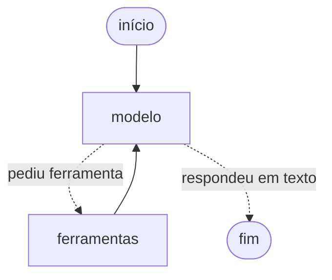
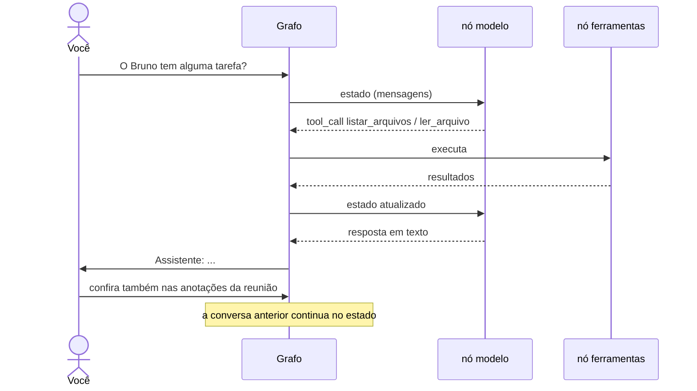
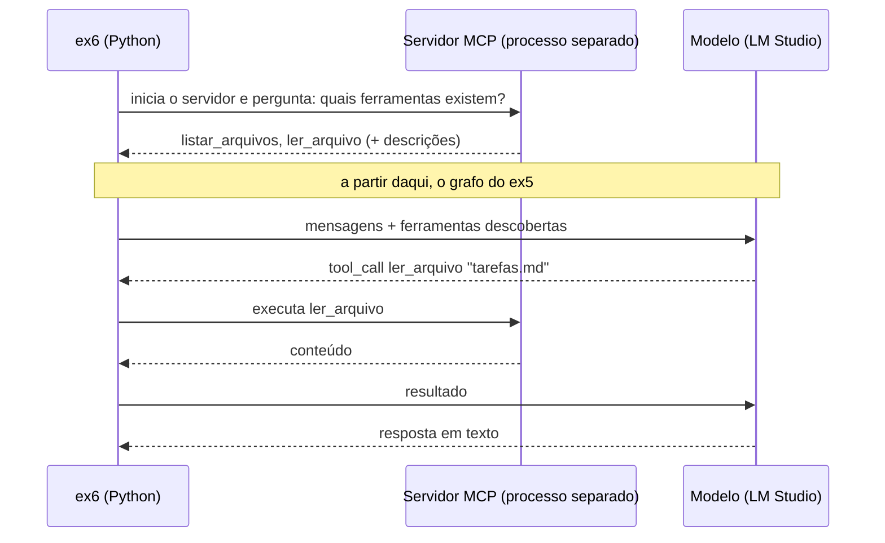
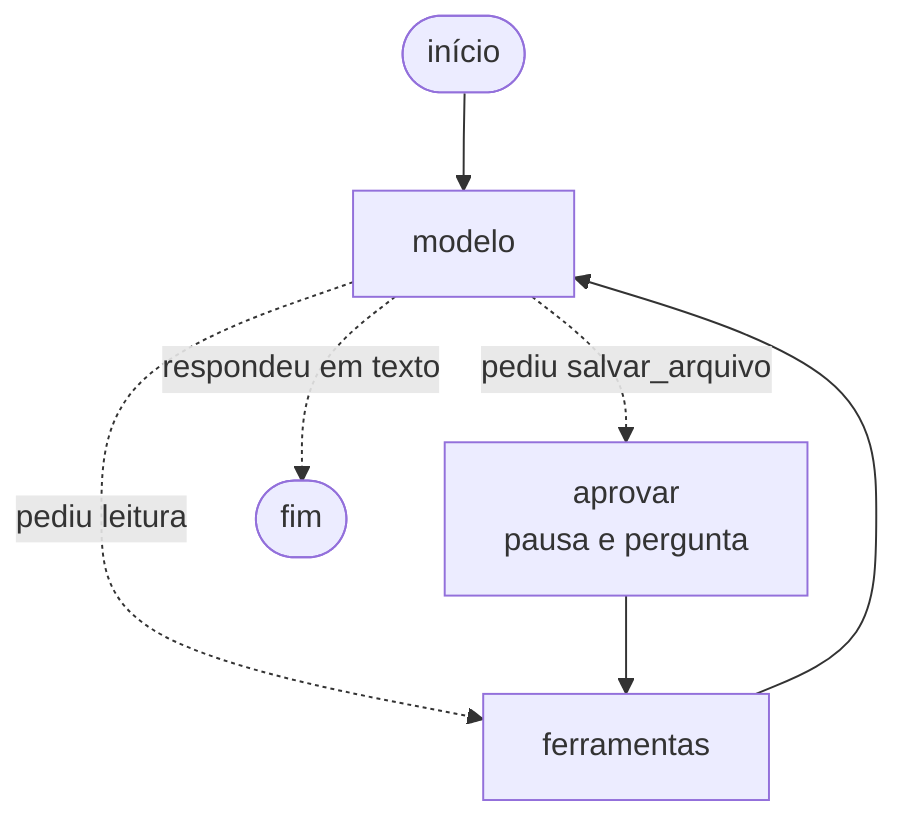
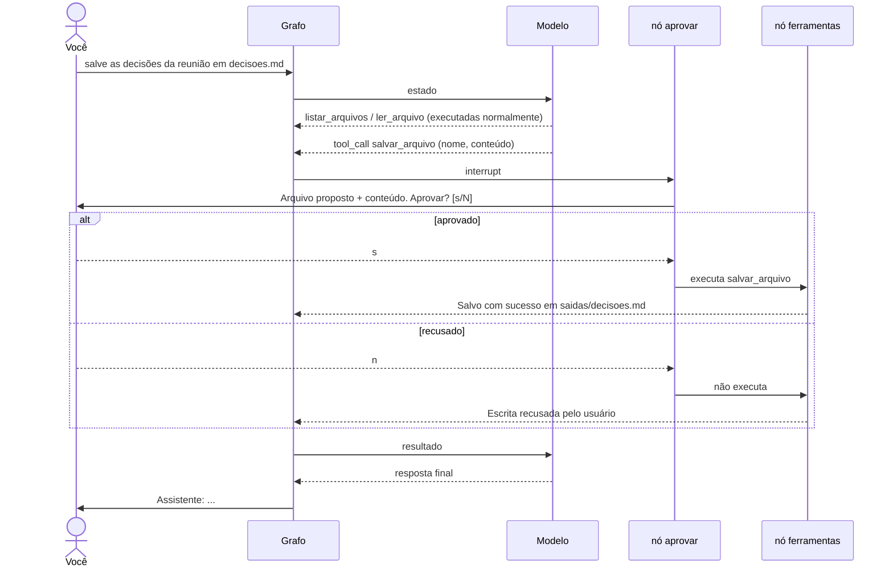
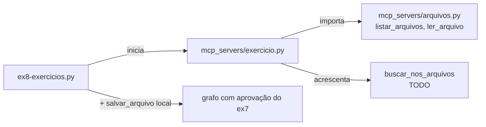

# Oficina: Agentes de IA e suas Ferramentas — SAEP 2026

Nesta oficina vamos construir, passo a passo, um **agente de IA** que conversa, consulta arquivos,
usa ferramentas descobertas por **MCP** e pede **aprovação humana** antes de escrever.
Tudo roda localmente, com um modelo pequeno servido pelo **LM Studio**.

Cada exemplo (`ex0` … `ex8`) acrescenta uma ideia nova ao anterior:

| Exemplo | Ideia nova | Conceito |
|---|---|---|
| `ex0-testar-ambiente.py` | Verificar se tudo está funcionando | Ambiente |
| `ex1-chat-minimo.py` | Enviar uma pergunta ao modelo | Modelo sem memória |
| `ex2-chat-historico.py` | Guardar a conversa | Histórico / memória |
| `ex3-chat-com-ferramentas.py` | O modelo pede uma função | *Tool calling* |
| `ex4-chat-loop.py` | Repetir até o modelo terminar | Loop do agente |
| `ex5-grafo.py` | Organizar o loop como grafo | LangGraph |
| `ex6-mcp.py` | Descobrir ferramentas em outro processo | MCP |
| `ex7-aprovacoes.py` | Pedir permissão antes de escrever | *Human in the loop* |
| `ex8-exercicios.py` | Criar sua própria ferramenta MCP | Exercício |

---

## Preparação

### 1. LM Studio e o modelo

1. Instale o [LM Studio](https://lmstudio.ai).
2. Baixe o modelo **`lmstudio-community/Qwen3-4B-Instruct-2507-GGUF`**, variante **`Q4_K_M`** (~2,5 GB).
3. Em **My Models**, abra a engrenagem do modelo e defina **Context Length = 8192**.
   Sem isso, o LM Studio reserva o contexto máximo (mais de 200 mil tokens) e o modelo pode ocupar
   vários GB a mais — em uma GPU de 4 GB ele nem carrega.
4. Na aba **Developer**, inicie o servidor local (porta `1234`).

> O modelo é carregado automaticamente na primeira requisição e descarregado após `LM_TTL`
> segundos sem uso (padrão: 300), liberando a memória ao final da oficina.

### 2. Projeto Python

Requer [uv](https://docs.astral.sh/uv/) e Python 3.12.

```bash
uv sync
cp .env.example .env        # no Windows: copy .env.example .env
```

Confira no `.env` se `LM_MODEL` é igual ao identificador exibido pelo LM Studio
(`qwen3-4b-instruct-2507`). As variáveis `LANGSMITH_*` são opcionais: com uma chave válida,
cada execução aparece no [LangSmith](https://smith.langchain.com) para inspeção.

### 3. Teste

```bash
uv run ex0-testar-ambiente.py
```

---

## Estrutura

```
app/
  modelo.py        # cria o modelo (LM Studio) e define as instruções do agente
  grafo.py         # grafo LangGraph usado do ex5 em diante
  interface.py     # conversa no terminal (/sair, /nova, aprovação)
  conexao_mcp.py   # inicia um servidor MCP e conecta a ele
tools/
  arquivos.py      # listar, ler e salvar arquivos (com proteção de caminho)
  ferramentas.py   # as mesmas funções transformadas em ferramentas LangChain
mcp_servers/
  arquivos.py      # servidor MCP com listar_arquivos e ler_arquivo
  exercicio.py     # ex8: ferramenta de busca a completar
  solucao.py       # ex8: gabarito
dados/             # arquivos que o agente consulta
saidas/            # arquivos aprovados no ex7/ex8 (limpa a cada execução)
```

Os arquivos em `dados/` descrevem um pequeno projeto escolar (um monitor de temperatura).
Eles têm "pegadinhas" de propósito: tarefas sem prazo, pendências repetidas entre arquivos e
informações que **não existem** (como a data de entrega). Um bom agente não deve inventá-las.

---

## ex0 — Testar o ambiente

```bash
uv run ex0-testar-ambiente.py            # testa MCP, LM Studio e tool calling
uv run ex0-testar-ambiente.py --sem-modelo   # testa só o MCP
```

**O que você vai ver:** a versão do Python, as ferramentas do servidor MCP, os arquivos de
`dados/`, os modelos disponíveis no LM Studio, uma resposta curta e uma chamada de ferramenta.
Se algo falhar aqui, os outros exemplos também vão falhar.

---

## ex1 — Chat mínimo

```bash
uv run ex1-chat-minimo.py
```

**O que você vai ver:** um chat que responde, mas **esquece tudo** a cada pergunta.

**O que há de novo:** a chamada ao modelo — uma lista de mensagens (`system` + `human`) entra,
uma resposta sai.



**Experimente:** diga seu nome e depois pergunte qual é.

---

## ex2 — Chat com histórico

```bash
uv run ex2-chat-historico.py
```

**O que você vai ver:** agora o assistente lembra o que foi dito. O programa mostra quantas
mensagens estão guardadas; `/nova` apaga o histórico.

**O que há de novo:** a "memória" é só uma lista no programa, reenviada inteira a cada pergunta.
O modelo continua sem memória própria.



---

## ex3 — Chat com ferramentas

```bash
uv run ex3-chat-com-ferramentas.py
```

**O que você vai ver:** o modelo **não sabe** a data de hoje, então ele pede para o programa
executar a função `data_atual`. O programa executa, devolve o resultado e o modelo responde.

**O que há de novo:** *tool calling*. O modelo não executa nada — ele só devolve o **nome da
ferramenta e os argumentos**. Quem executa é o nosso código.



---

## ex4 — O loop do agente

```bash
uv run ex4-chat-loop.py
```

**O que você vai ver:** um pedido como *"leia as anotações e resuma as pendências"* faz o modelo
listar os arquivos, ler os que interessam e só então responder. Cada ferramenta usada aparece
no terminal.

**O que há de novo:** um **loop**. O modelo pode pedir várias ferramentas em sequência; o
programa repete até vir uma resposta em texto (ou até 6 passos, para não rodar para sempre).
Isto já é um agente.



---

## ex5 — O loop como grafo (LangGraph)

```bash
uv run ex5-grafo.py
```

**O que você vai ver:** o mesmo comportamento do ex4, agora em um chat contínuo — dá para fazer
perguntas de acompanhamento (*"confira também nas anotações da reunião"*).

**O que há de novo:** o loop vira um **grafo** com dois nós. O LangGraph guarda o estado da conversa
(`checkpointer`) e decide o próximo nó pela última resposta do modelo.





---

## ex6 — Ferramentas via MCP

```bash
uv run ex6-mcp.py
```

**O que você vai ver:** o programa imprime as ferramentas **descobertas** no servidor MCP e o chat
funciona como no ex5.

**O que há de novo:** as ferramentas não são mais importadas do nosso código. Elas vivem em
outro processo (`mcp_servers/arquivos.py`) e são descobertas em tempo de execução pelo protocolo
**MCP**. Qualquer servidor MCP (de arquivos, banco de dados, APIs…) poderia ser plugado aqui.



---

## ex7 — Aprovação humana antes de escrever

```bash
uv run ex7-aprovacoes.py
```

**O que você vai ver:** peça *"salve as decisões da reunião em decisoes.md"*. Antes de gravar,
o programa mostra o nome e o conteúdo completo do arquivo e pergunta se você aprova. Recusando,
nada é escrito. Aprovando, o arquivo aparece em `saidas/`.

**O que há de novo:** uma ferramenta que **altera** algo (`salvar_arquivo`) e um nó `aprovar`
que **pausa o grafo** (`interrupt`) até a resposta de uma pessoa. As instruções de escrita só
são dadas ao modelo quando essa ferramenta existe.

A cada execução, o ex7 (e o ex8) apagam os arquivos gerados anteriormente em `saidas/`.





---

## ex8 — Exercício: sua ferramenta MCP

```bash
uv run ex8-exercicios.py              # usa mcp_servers/exercicio.py (a completar)
uv run ex8-exercicios.py --solucao    # usa o gabarito
```

**O que você vai ver:** o agente já enxerga a ferramenta `buscar_nos_arquivos`, mas ela ainda não
está implementada — o modelo recebe o erro e avisa que a busca falhou.

**Sua tarefa:** complete `buscar_nos_arquivos` em `mcp_servers/exercicio.py` para que ela percorra
os arquivos e devolva `arquivo`, `linha` e `texto` de cada ocorrência. Reinicie o exemplo e
pergunte *"em quais arquivos aparece a palavra sensor?"*.



---

## Problemas comuns

| Sintoma | Causa provável | O que fazer |
|---|---|---|
| `Connection refused` | Servidor do LM Studio desligado | Inicie o servidor na aba Developer |
| `model not found` | `LM_MODEL` diferente do identificador | Copie o identificador exato do LM Studio para o `.env` |
| Memória muito alta / modelo não carrega | Context Length no máximo | Defina Context Length = 8192 nas configurações do modelo |
| Respostas diferentes das esperadas | Outro modelo ou outra quantização | Use o `Qwen3-4B-Instruct-2507` `Q4_K_M` em **GGUF** |
| O modelo diz que vai fazer algo e para | Limitação de modelos pequenos | Peça de novo, mais direto (*"leia o arquivo e responda"*) |
